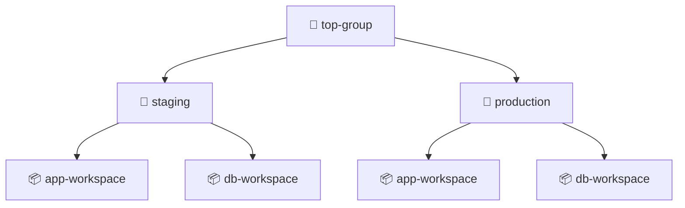
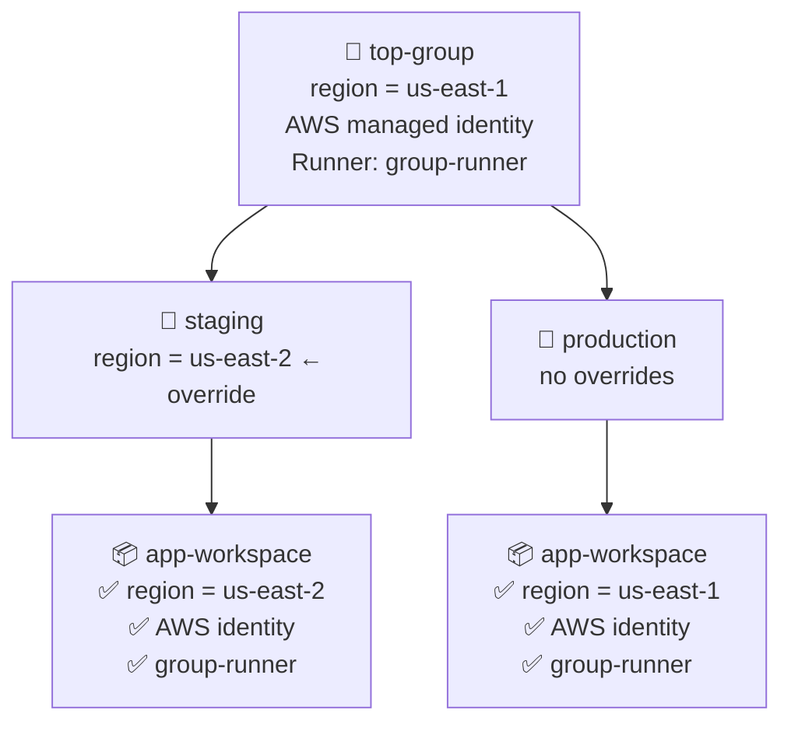

## What are groups?

Groups are containers that hold configuration information to help organize workspaces in a hierarchical manner.

## Inheritance

Resources set at a group level are inherited by all child groups and workspaces. Children can override inherited variable values. The following resources support inheritance: variables, managed identities, memberships, service accounts, runner agents, Terraform modules, and VCS providers.

Tharsis UI's groups page provides access to activity events, runs, variables, managed identities, runner agents, service accounts, Terraform modules, VCS providers, federated registries, provider mirror, GPG keys, members, and settings.

:::tip Have a question?
Check the [FAQ](#frequently-asked-questions-faq) to see if there's already an answer.
:::

---

## Create a group

Groups can be created directly via the UI or the [Tharsis-CLI](../cli/tharsis/intro.md).
:::caution top-level groups
**Top-level** groups may only be created by system administrators.
:::

### Creating a subgroup via the UI

1. From the group details page, click the `New Subgroup` button in the upper right-hand corner:
   

2. Provide the group name, optionally a short memorable description, and click `CREATE GROUP`:
   

   :::caution
   Group names may only contain **digits**, **lowercase** letters with a **hyphen** or an **underscore** in non-leading or trailing positions.

   A group's name **cannot** be changed once created. It will have to be deleted and recreated, which is **dangerous**.
   :::

## Update a group

1. Click `Settings` on the left-hand side navigation menu to navigate to the group settings page:
   

2. Provide a new group description (can be empty) and click `SAVE CHANGES`:
   

## Advanced Settings

### Migrate a group

1. From the group settings page, click the `MIGRATE GROUP` button:
   

2. Select the new parent group and then click `MIGRATE`:
   

:::info
To migrate a group, the user must have permissions to create a group in the new hierarchy and delete the group from the current hierarchy. Without these permissions, the migration will not succeed. To migrate a group to root level, the user must have system administrator permissions.
:::

:::danger migration is dangerous
Migrating a group will remove <u>**any inherited resource assignments**</u>, such as managed identities, service accounts, etc., that are not available in the new group hierarchy.
:::

### Delete a group

1. From the group settings page, click the `DELETE GROUP` button:
   

2. Enter the group path to confirm deleting and then click `DELETE`:
   

:::danger deletion is dangerous
Deleting a group is an <u>**irreversible**</u> operation. All nested groups and/or workspaces with their associated deployment states will be deleted and <u>**cannot be recovered**</u>.

Proceed with **extreme** caution as deletion **permanently** removes <u>**ALL**</u> nested groups and/or workspaces with their associated deployment states. If unsure, **do not** proceed.
:::

## Frequently asked questions (FAQ)

### Who can create/update/migrate/delete groups?

- Owner can delete top-level groups; deployer can delete lower-level groups.
- Owner and deployer can migrate a group. They must also be an owner or deployer in the target parent group.
- Viewer **cannot** modify a group.
- System administrator can create/migrate/delete **any** group.
