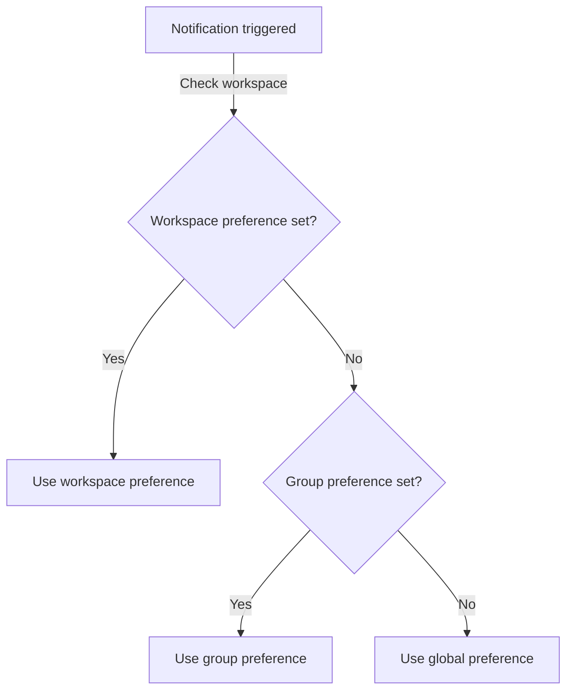

## What are notification preferences?

Notification preferences control which email notifications you receive from Tharsis. You can configure them at three levels: global, per-group, and per-workspace. Each level can inherit from the one above it or be set independently.

:::tip Have a question?
Check the [FAQ](#frequently-asked-questions-faq) to see if there's already an answer.
:::

---

## Preference scope options

Tharsis provides four scope options that determine which notifications you receive:

- **ALL**: receive notifications for all events, regardless of whether you are involved.
- **PARTICIPATE**: receive notifications only for events you are directly involved in. For example, a run you triggered that fails, or a workspace where your membership changes.
- **CUSTOM**: choose specific event types to be notified about.
- **NONE**: do not receive any notifications.

The default preference for all new users is **PARTICIPATE**.

## Custom event options

When the scope is set to **CUSTOM**, you can select one or more of the following events:

- **Failed run**: a [run](./runs.md) you are involved in has failed.
- **Service account secret expiration**: a [service account](./service_accounts.md) client secret is about to expire.
- **Membership change**: a member has been added to, removed from, or had their role updated in a group or workspace.

At least one event must be selected when using the CUSTOM scope.

:::important
If the scope is set to **CUSTOM** and no events are selected, the preference cannot be saved.
:::

## Preference levels

Notification preferences follow an inheritance chain:

1. **Global**: applies to everything by default.
2. **Per-group**: overrides the global preference for a specific group.
3. **Per-workspace**: overrides the group (or global) preference for a specific workspace.

The most specific level always takes priority. If no override is set at the group or workspace level, the preference is inherited from the level above.

## Viewing notification preferences

To view your global notification preference, click on your profile icon in the top-right corner and select **Preferences**. The **Notifications** section displays your current global scope.

For group and workspace preferences, navigate to the target group or workspace. The notification bell icon displays your current preference for that scope. If the preference is inherited, it will indicate where it is inherited from (e.g., "Inherited from global preference" or "Inherited from [group path]").

## Configuring global preferences

The global preference is your default notification setting. It applies to all groups and workspaces unless overridden at a lower level.

1. Click on your profile icon in the top-right corner and select **Preferences**.
2. In the **Notifications** section, click on the notification bell icon.
3. Select **Change Preference**.
4. Select a scope: **ALL**, **PARTICIPATE**, **CUSTOM**, or **NONE**.
5. If you selected **CUSTOM**, check the events you want to be notified about.
6. Click **Save**.

## Configuring per-group preferences

You can set a notification preference for a specific group. This overrides your global preference for that group and all workspaces within it (unless a workspace has its own override).

1. Navigate to the target group.
2. Click on the notification bell icon.
3. Select **Change Preference**.
4. Uncheck **Inherit notification preference from parent** to set your own preference.
5. Select a scope: **ALL**, **PARTICIPATE**, **CUSTOM**, or **NONE**.
6. If you selected **CUSTOM**, check the events you want to be notified about.
7. Click **Save**.

To revert to the global preference, check **Inherit notification preference from parent** and click **Save**.

## Configuring per-workspace preferences

You can set a notification preference for a specific workspace. This overrides the group and global preferences for that workspace only.

1. Navigate to the target workspace.
2. Click on the notification bell icon.
3. Select **Change Preference**.
4. Uncheck **Inherit notification preference from parent** to set your own preference.
5. Select a scope: **ALL**, **PARTICIPATE**, **CUSTOM**, or **NONE**.
6. If you selected **CUSTOM**, check the events you want to be notified about.
7. Click **Save**.

To revert to the group's preference, check **Inherit notification preference from parent** and click **Save**.

## Frequently asked questions (FAQ)

### Who can configure notification preferences?

Any user can configure their own notification preferences. There are no role or permission requirements. Notification preferences are personal settings and do not affect other users.

### What is the default notification setting?

**PARTICIPATE**. You receive notifications only for events you are directly involved in.

### Can I turn off all notifications?

Yes. Set your global preference to **NONE**. This stops all notifications unless a specific group or workspace has its own override set to a different scope.

### What does "inherited" mean?

When a preference is inherited, it means the group or workspace is using the setting from the level above (global or group) rather than its own. The notification bell icon will indicate where the preference is inherited from.

### Can I override an inherited preference?

Yes. At the group or workspace level, uncheck **Inherit notification preference from parent** in the preference dialog. You can then choose your own scope. You can revert to inheriting at any time by checking it again.

### If I set a group preference, does it apply to all workspaces in that group?

Yes, unless a workspace within that group has its own override. The workspace-level preference always takes priority over the group-level preference.
