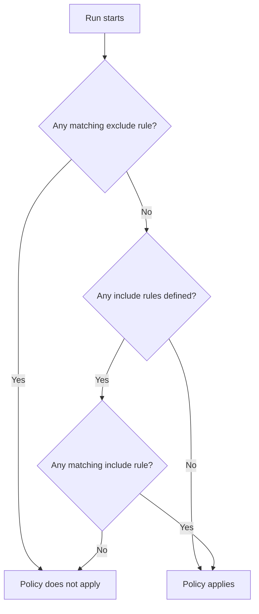
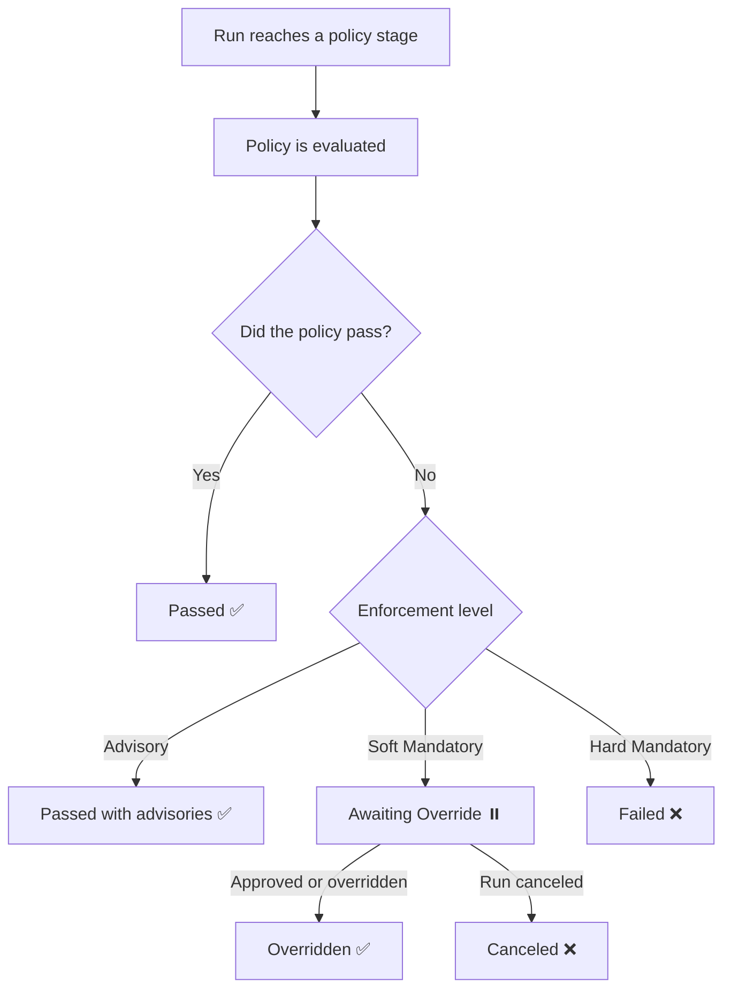

## What are policies?

Policies are group-level guardrails that can apply to different kinds of resources. A policy is owned by a [group](./groups.md) and applies to resources beneath it based on its scope, so a policy set on a parent group can reach down to child groups and their [workspaces](./workspaces.md).

Tharsis offers two policy types, both of which apply to [runs](./runs.md):

- **Open Policy Agent (OPA)**: you write your own rules in [Rego](https://www.openpolicyagent.org/docs/latest/policy-language/) and publish them as a package. The rule content decides whether a run passes. Learn more about [OPA](https://www.openpolicyagent.org/).
- **Module Attestation**: the run may only proceed when the [module](./module_registry.md) it deploys carries a signed, trusted attestation. This checks where a module came from rather than what a run does.

When a run reaches a stage a policy applies to, Tharsis evaluates the policy and either lets the run continue, records a warning, or blocks the run, depending on how the policy is set up.

:::tip Have a question?
Check the [FAQ](#frequently-asked-questions-faq) to see if there's already an answer.
:::

---

## Policy packages (for OPA)

An OPA policy points at a **package**: a group-owned, versioned artifact that holds your Rego rule content. Packages live in the [package registry](./package_registry.md), which covers creating a package, publishing versions, mutable versions, visibility, and deleting versions.

:::note
Modules used for **Module Attestation** policies are not created in the package registry. They are managed through the [API](/docs/setup/api.md) or the [CLI](/docs/cli/tharsis/intro.md). See [Module Attestation config](#module-attestation-config).
:::

## Creating a policy

Policies are managed from the group's `Policies` page on the left sidebar, under the `Security` section.

1. Navigate to the target group and click on `Policies` on the left sidebar, under the `Security` section.
2. Click on `Add Policy`.
3. Select the policy type: `OPA` or `Module Attestation`.
4. Enter a `Name` and an optional `Description`.
5. Fill in the configuration for the chosen type.
6. Set the [stage](#stages-when-a-policy-runs), [enforcement level](#enforcement-levels), and [scope](#scope).
7. Optionally add [approvals](#approvals).
8. Click on `Add Policy`.

:::important
A policy's type and name cannot be changed after it is created. Choose them carefully.
:::

### OPA config

For an OPA policy you provide:

- `Package`: the package whose Rego content the policy evaluates. You can also type the source of a package you plan to publish later.
- `Version constraint`: which version of the package to use, written as a semantic-version constraint such as `1.0.0` or a range like `>= 1.0.0, < 2.0.0`. Leaving it blank always uses the latest version.
- `Digest (optional)`: a hex-encoded SHA-256 checksum that pins the exact content, so the run fails if the policy content changes.

### Module Attestation config

For a Module Attestation policy you provide:

- `Public Key`: a PEM-encoded public key. The module a run deploys must carry an attestation signed by this key. ECDSA and RSA public keys are supported.
- `In-Toto Predicate type (optional)`: an [in-toto](https://in-toto.io/) predicate type. When set, the attestation's predicate type must match it. When left blank, any predicate type is accepted.
- `Verify state lineage`: when enabled, the workspace's current state must have been written by a run that used the same module source. When this check fails, the policy fails and is handled at its enforcement level.

:::caution Important
A Module Attestation policy only checks modules from a Tharsis module registry. A run that deploys anything else, such as one built from an uploaded configuration, fails the policy and is then handled at its enforcement level.
:::

Attestations themselves are uploaded and managed through the CLI:

- See [module create-attestation subcommand](/docs/cli/tharsis/commands.md#module-create-attestation-subcommand) to create a module attestation.
- See [module list-attestations subcommand](/docs/cli/tharsis/commands.md#module-list-attestations-subcommand) to list module attestations.
- See [module get-attestation subcommand](/docs/cli/tharsis/commands.md#module-get-attestation-subcommand) to get a module attestation.
- See [module update-attestation subcommand](/docs/cli/tharsis/commands.md#module-update-attestation-subcommand) to update a module attestation.
- See [module delete-attestation subcommand](/docs/cli/tharsis/commands.md#module-delete-attestation-subcommand) to delete a module attestation.

## Stages (when a policy runs)

A policy runs at a specific stage of a run. The stages available depend on the policy type:

- **OPA** policies can run at `Pre Plan`, `Post Plan`, `Pre Apply`, or `Post Apply`.
- **Module Attestation** policies can run at `Pre Plan` or `Pre Apply` only. The module is verified before it is used, so a later stage would come too late to stop anything.

:::note
`Post Apply` is advisory-only. State has already been written by the time it runs, so there is nothing left for a stronger enforcement level to protect.
:::

## Enforcement levels

The enforcement level decides what a policy failure does:

- `Advisory`: records the failure but never blocks the run.
- `Soft Mandatory`: blocks the run, but the block can be overridden.
- `Hard Mandatory`: blocks the run and cannot be overridden.

The level is set through two dropdowns: `Apply Runs` and `Speculative & Assessment Runs`. Apply runs can use any of the three levels. Speculative and assessment runs (runs that have no apply) can only use `Advisory` or `Hard Mandatory`.

:::note
`Soft Mandatory` is not available on a run with no apply, because an override would have nothing to unblock.
:::

## Scope

Scope decides which workspaces a policy applies to. Scope is optional: a policy with no scope rules applies to every workspace in its group and subgroups. Add scope rules to narrow that down. Each rule has a type and an action of `Include` or `Exclude`.

:::info
Scope rules are set in the `Scope Rules` section when a policy is created or edited in the UI.
:::

Rule types:

- `Workspace`: matches the path of the run's workspace.
- `Group`: matches any workspace under a group whose path matches, so it covers the whole subtree.
- `Managed Identity`: matches the [managed identities](./managed_identities.md) the run's workspace uses. An alias matches both its own path and the path of the identity it aliases.

Each rule's value can be a path glob pattern or a [resource identifier](./resource_identifiers.md) (TRN). Add a rule with `Add Rule`. A rule left without a value is ignored.

Scope resolves like this:

- **Excludes are checked first and win.** A matching exclude removes the policy for that run.
- **Includes are checked next.** With include rules present, at least one must match.
- With **no include rules**, the policy applies everywhere except what the excludes remove.
- An **empty scope** (no rules at all) applies to every workspace under the owning group.

:::tip
Because a **Group** rule covers the whole subtree, a parent group's policy can apply down to its child groups and their workspaces.
:::

## Approvals

A **Soft Mandatory** policy can require approvals before its block is cleared. On a policy you can set:

- `Required Approvals`: how many approvals are needed.
- `Allowed Approvers`: the users, teams, and service accounts allowed to approve.

Once a run is blocked by a soft-mandatory failure, an eligible approver can:

- `Approve`: counts toward the required number. Once the requirement is met, the block clears.
- `Reject`: records the decision but does not clear the block. The run keeps waiting on the rest.
- Override: bypasses approvals and clears the block immediately. This appears as `Override Gate` when the failure has approvers, and as `Override` when it has none.

Approvers can find runs waiting on them in the `Awaiting My Approval` inbox. The home page also shows an `Awaiting My Approval` panel with the number of runs waiting on you, linking to the same inbox.

:::important
Approvers can only be set on a **Soft Mandatory** policy. You must set both a required-approval count of at least one and at least one approver, or leave both empty. The same approver cannot be listed twice.
:::

## Seeing results on a run

Each run stage shows a policy check panel with the outcome of every policy that applied.

**How a policy check resolves on a run**

A reader may see:

| Outcome | Meaning |
| --- | --- |
| `Passed` | The policy check passed. |
| `Passed with advisories` | Advisory failures occurred but never block. They surface with a warning marker on the run and the stage. |
| `Awaiting Override` | A soft-mandatory failure is waiting on approval or override. |
| `Failed` | A hard-mandatory failure. |
| `Skipped` | The stage did not run. This covers a no-change plan, a run with no apply, or a stage that never ran because the run stopped earlier. |
| `Overridden` | A soft-mandatory block was cleared by override. |
| `Canceled` | The check was canceled. |

A run keeps showing the policies it evaluated even after they change. If a policy is later deleted, it still appears on that run's check panel, marked `(deleted)`.

### Retrying a check

You can retry a policy check after fixing the package content or clearing a transient error. A retry re-evaluates the policy against the run's pinned version constraint rather than a frozen version, so it can pick up a newly published version that satisfies the constraint.

### When a required package or its content is missing

When a policy cannot find what it needs (a missing package, an unresolved version, deleted content, or a digest mismatch), the failure is reported as a finding on the policy check, naming the specific reason, and then handled at the policy's enforcement level:

- **Advisory** records it and lets the run continue.
- **Soft Mandatory** sends it to `Awaiting Override`.
- **Hard Mandatory** stops the run.

### While a run is waiting

- When a waiting run is canceled, it ends with a clear status rather than waiting forever.
- When a waiting run loses an approver, that approver is dropped from those eligible and the run keeps waiting on the rest. If a soft failure ends up with no eligible approvers left, it can only be cleared by override.

### Assigned Policies view

Each workspace has an `Assigned Policies` view that lists the policies that apply to it. Navigate to the workspace, then click on `Assigned Policies` on the left sidebar, under the `Security` section.

## Activity

Policy, package, and approval actions appear in the group's activity history, so you can see who created, changed, or acted on a policy or package over time.

## Permissions and access

Viewing and managing are separate permissions for both policies and packages, and managing is broken down into create, update, and delete.

Overriding a soft-mandatory block requires permission to update the policy being overridden.

The built-in roles map to policy and package access like this:

| Role | Packages | Policies |
| --- | --- | --- |
| `Owner` | Full manage | Full manage |
| `Deployer` | Full manage | View only |
| `Publisher` | Full manage | View only |
| `Viewer` | View only | View only |

:::note
The notable case: `Deployer` and `Publisher` can fully manage packages but can only view policies.
:::

## Frequently asked questions (FAQ)

### What's the difference between OPA and Module Attestation policies?

An **OPA** policy runs your own Rego rules against a run to decide whether it passes. A **Module Attestation** policy checks that the module a run deploys carries a signed, trusted attestation. OPA checks what a run does; Module Attestation checks where a module came from.

### Can a policy's type or name be changed after creation?

No. Both are fixed once the policy is created. The rest of the configuration can be updated.

### Does a policy apply to child groups?

Yes, if the scope matches. A **Group** scope rule covers the whole subtree, and a policy with an empty scope applies to every workspace under the owning group, including those in child groups.

### Why can't I use Soft Mandatory on a speculative or assessment run?

These runs have no apply, so an override would have nothing to unblock. For these runs a policy can only be **Advisory** (record the failure) or **Hard Mandatory** (refuse to run).
