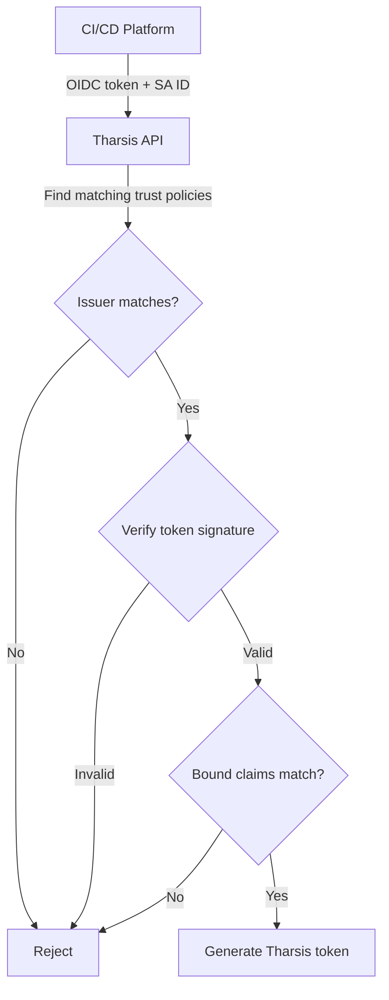
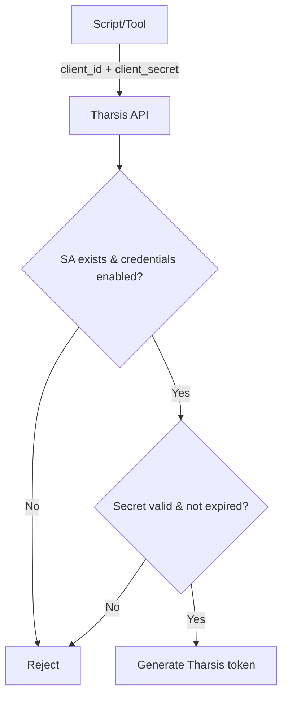

## What are service accounts?

Service Accounts are used for Machine to Machine (M2M) authentication. They allow automated systems like CI/CD pipelines to authenticate and interface with Tharsis.

:::tip Did you know...
Service accounts allow the Tharsis CLI to be directly integrated into a [CI/CD](https://en.wikipedia.org/wiki/CI/CD) pipeline.
:::

:::tip Have a question?
Check the [FAQ](#frequently-asked-questions-faq) to see if there's already an answer.
:::

---

## Authentication methods

**OIDC Federation**



**Client Credentials**



Service accounts support two authentication methods:

1. **OIDC Federation** - Uses [OIDC](https://openid.net/connect/) trust policies to verify tokens from identity providers (e.g., GitLab CI, GitHub Actions)
2. **Client Credentials** - Uses a client ID and secret for direct authentication

You can enable one or both methods on a service account.

---

## Create a service account

1. Navigate to the target group's page and click on the `Service Accounts` tab. Click on the `NEW SERVICE ACCOUNT` button.

2. Fill in the required fields:
   - **Name**: A unique name for the service account
   - **Description** (optional): A description of the service account's purpose

3. Configure at least one authentication method:

   **For OIDC Federation:**
   - Add one or more OIDC trust policies with:
     - Issuer URL (e.g., `https://gitlab.com`)
     - Bound claims to verify (e.g., `namespace_path`, `project_id`)

   **For Client Credentials:**
   - Check "Enable client credentials"
   - Optionally set an expiration date (1 day to the configured maximum, defaults to the maximum)
   - **Important**: Copy the client ID and secret when displayed - the secret is only shown once

4. Add the service account as a member to a group or workspace:
   - Navigate to the group or workspace where this service account will be used and head to the `Members` page on the left and click on <span style={{ color: '#4db6ac' }}>`ADD MEMBER`</span>:
     

   - Click on `Service Account` in the `Add Member` page:
     

   - Click on the `Service Account` field and select the appropriate service account that was just created, a role, and click <span style={{ color: '#4db6ac' }}>`ADD MEMBER`</span>:
     

---

## View service account details

After creating a service account, click on it to view its details. The details page has two tabs:

- **OIDC Federation** - Shows configured trust policies with their issuers and bound claims
- **Client Credentials** - Shows whether client credentials are enabled and when the secret expires

---

## Using client credentials

Client credentials provide a simpler authentication method that doesn't require an external identity provider.

### Obtaining a token

Make a POST request to the token endpoint:

```bash
curl -X POST https://your-tharsis-instance/v1/serviceaccounts/token \
  -d "grant_type=client_credentials" \
  -d "client_id=YOUR_CLIENT_ID" \
  -d "client_secret=YOUR_CLIENT_SECRET"
```

Response:

```json
{
  "access_token": "eyJhbGciOiJSUzI1NiIs...",
  "token_type": "Bearer",
  "expires_in": 300
}
```

Use the `access_token` as a Bearer token in the `Authorization` header for subsequent API requests.

### Secret expiration

Client secrets expire after a configurable period. The maximum expiration is configured by your Tharsis administrator (default: 90 days). You'll receive email notifications 7 days before expiration if you have the "Service Account Secret Expiration" notification preference enabled.

To reset an expiring or compromised secret:

1. Navigate to the service account details page
2. Click "Reset Client Credentials"
3. Optionally set a new expiration date
4. Copy the new client secret - it's only shown once

:::warning
Resetting credentials immediately invalidates the old secret. Update all systems using the old credentials before or immediately after resetting.
:::

---

## Viewing service account memberships

To view which groups and workspaces a service account is a member of, navigate to the service account's details page and select the **Assigned Namespaces** tab. This is useful for understanding the scope of a service account's access and for determining who needs Owner permissions to edit it.

---

## Update a service account

To update a service account, navigate to the "Service Accounts" page, select the service account you want to update, and click on the "Edit" button.

You can update:

- Description
- OIDC trust policies (add, modify, or remove)
- Client credentials (enable or disable)

When enabling client credentials on an existing service account, the client ID and secret will be displayed once. Make sure to copy them.

Click `Update Service Account` to save the changes.

:::important
If the service account is a member of any groups or workspaces, the caller must have an **Owner** role in **all** of those groups and/or workspaces to edit the service account. This includes modifying trust policies, enabling/disabling client credentials, and resetting (rotating) client credentials. This restriction prevents members with lower roles from escalating access by modifying a service account's authentication configuration. Without this safeguard, a compromised or malicious service account could potentially modify its own authentication requirements.

If the service account is not yet a member of any groups or workspaces, any caller with sufficient permissions can edit it.
:::

---

## Delete a service account

To delete a service account, navigate to the "Service Accounts" page, select the service account you want to delete, and click on the upside-down caret next to the "Edit" button. Then click on the "Delete Service Account" button.

:::danger
Deleting a service account will break any integrations that rely on it, such as CI/CD pipelines.
:::

---

## Assigning Roles to a Service Account

After creating a service account, you can assign roles to it. Navigate to the target group or workspace page and click on the "Members" tab. Then click on the "Add Member" button.

Select "Service Account" from the options and search for the service account you want to assign a role to. Then select the role you want to assign to the service account and click `Add Member`. Generally, a `deployer` role is sufficient for most use cases.

:::warning
Without a role, the service account will not be able to access any resources in the group or workspace.
:::

---

## Frequently asked questions (FAQ)

### Who can create / update / delete service accounts?

Deployer or higher roles can create a service account.

### Who can delete a service account?

Any member of the target group with a role of Deployer or higher can delete a service account. Unlike editing, deleting a service account does not require an Owner role in all groups or workspaces where the service account is a member.

### How do I use a service account with the Tharsis CLI?

See the [CLI documentation](/docs/cli/tharsis/intro.md#service-account) for more information.

### Why is my service account not working?

Please make sure that the service account is a member of the group or workspace and has the necessary role assigned to it. Also, ensure that the service account has the correct authentication configuration:

- For OIDC: verify the Identity Provider information and bound claims
- For client credentials: verify the client secret hasn't expired

### What are bound claims?

Bound claims are used to verify the JSON Web Token (JWT) that is issued by the Identity Provider against the service account upon login. Some common claims are `aud`, `sub`, `namespace_path`, `job_id`, etc., depending on the Identity Provider.

### What is the difference between OIDC and client credentials authentication?

- **OIDC Federation**: Requires an external identity provider (like GitLab or GitHub) to issue tokens. Best for CI/CD pipelines where the platform provides OIDC tokens.
- **Client Credentials**: Uses a client ID and secret directly with Tharsis. Simpler setup but requires secure storage of the client secret.

### When should I use client credentials vs OIDC?

Use **OIDC** when:

- Your CI/CD platform supports OIDC tokens (GitLab CI, GitHub Actions, etc.)
- You want to avoid storing long-lived secrets
- You need fine-grained control over which jobs can authenticate

Use **client credentials** when:

- Your system doesn't support OIDC
- You need a simpler authentication setup
- You're integrating with custom tooling or scripts

### How do I rotate client credentials?

Navigate to the service account details page and click "Reset Client Credentials". This generates a new client secret and invalidates the old one immediately. You can optionally set a new expiration date. Make sure to copy the new secret — it's only shown once.

If the service account has active memberships, you'll need an **Owner** role in all of those groups and/or workspaces to reset credentials. See [Updating a service account](#update-a-service-account) for details.

### What happens when my client secret expires?

The service account will no longer be able to authenticate using client credentials. You'll need to reset the credentials and update any systems using the old secret. Enable the "Service Account Secret Expiration" notification to receive warnings 7 days before expiration.

### Should I just give my service account an owner role?

No, it is not recommended to give a service account an owner role. Generally, a `deployer` role is sufficient for most use cases. An owner role will allow the service account to manage the group, its members, and arbitrarily perform any action within the namespace. This goes against the principle of least privilege.

### Can a service account from one group access resources in another group?

No, a service account can only access resources within the group it is a member of.

### Will the CLI periodically renew the token for the service account?

Yes, the CLI will periodically renew the token for the service account. The token should be renewed a short period of time before it expires.
