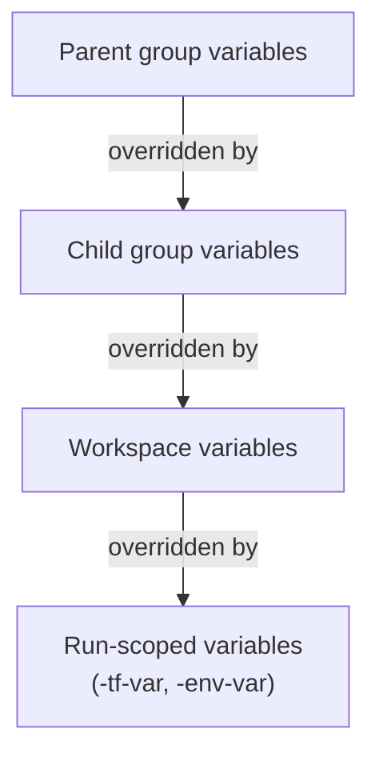

Variables in Tharsis allow you to pass configuration values to your Terraform deployments without hardcoding them in your modules. They can be set at the group or workspace level and support inheritance through the group hierarchy.

:::tip Have a question?
Check the [FAQ](#frequently-asked-questions-faq) to see if there's already an answer.
:::

## Variable categories

Tharsis supports two categories of variables:

### Terraform variables

Terraform variables are passed to Terraform as input variables (`-var`). They correspond to `variable` blocks in your Terraform configuration.

```hcl title="variables.tf"
variable "instance_type" {
  type    = string
  default = "t3.micro"
}
```

Set the value in Tharsis by creating a Terraform variable with the key `instance_type`.

### Environment variables

Environment variables are set in the shell environment during Terraform execution. Common uses include:

- `TF_TOKEN_*` — credentials for private module registries (see [Module Sources](../deployments/module_sources.md))
- `TF_LOG` — Terraform log level for debugging

## Creating variables

### Via the UI

1. Navigate to the group or workspace.
2. Select the **Variables** tab.
3. Click **New Variable**.
4. Choose the category (Terraform or Environment), enter the key and value.
5. Optionally mark as **HCL** (for complex Terraform values) or **Sensitive**.
6. Click **Create Variable**.

### Via the CLI

```shell title="Create a Terraform variable"
tharsis variable set -category terraform -key instance_type -value t3.micro my-group/my-workspace
```

```shell title="Create an environment variable"
tharsis variable set -category environment -key TF_LOG -value DEBUG my-group/my-workspace
```

### During a run

Variables can also be passed inline when triggering a run via the CLI:

```shell title="Pass variables during apply"
tharsis apply \
  -tf-var "instance_type=t3.large" \
  -env-var "TF_LOG=DEBUG" \
  -directory-path ./terraform \
  my-group/my-workspace
```

Use `-tf-var-file` or `-env-var-file` to pass variables from a file.

## HCL variables

When a Terraform variable expects a complex type (list, map, object), mark it as **HCL** so Tharsis passes the value as an HCL expression rather than a plain string.

```hcl title="Example: list variable"
variable "availability_zones" {
  type = list(string)
}
```

Set the value in Tharsis as an HCL variable:

```
["us-east-1a", "us-east-1b", "us-east-1c"]
```

## Sensitive variables

Marking a variable as **sensitive** encrypts its value at rest. Sensitive variables:

- Are visible in the UI and API only to users with sufficient permissions.
- Are masked in run logs.

Use sensitive variables for tokens, passwords, and other secrets. For cloud provider credentials, [managed identities](managed_identities.md) are the preferred approach since they eliminate secrets entirely.

## Inheritance

Variables set at a group level are inherited by all child groups and workspaces. This allows you to define common configuration once and have it apply everywhere.

```
top-group/              ← TF_LOG=INFO (environment variable)
├── staging/            ← inherits TF_LOG=INFO
│   └── app-workspace   ← inherits TF_LOG=INFO
└── production/         ← TF_LOG=ERROR (overrides parent)
    └── app-workspace   ← inherits TF_LOG=ERROR
```

**Precedence rules:**

1. Workspace variables override group variables.
2. Child group variables override parent group variables.
3. Variables passed inline during a run (via `-tf-var` or `-env-var`) override workspace variables.



## Restricted environment variables

Certain environment variable names are reserved by Terraform and cannot be set as environment variables in Tharsis. If set, the job executor will either handle them specially or log an error.

**Supported (handled by the job executor):**

| Variable          | Behavior                                    | Valid values                              |
| ----------------- | ------------------------------------------- | ----------------------------------------- |
| `TF_LOG`          | Sets the Terraform log level.               | `TRACE`, `DEBUG`, `INFO`, `WARN`, `ERROR` |
| `TF_LOG_CORE`     | Sets the log level for Terraform core.      | `TRACE`, `DEBUG`, `INFO`, `WARN`, `ERROR` |
| `TF_LOG_PROVIDER` | Sets the log level for Terraform providers. | `TRACE`, `DEBUG`, `INFO`, `WARN`, `ERROR` |

**Prohibited (will cause an error if set):**

| Variable                        | Reason                                                |
| ------------------------------- | ----------------------------------------------------- |
| `TF_VAR_*`                      | Use Terraform category variables instead.             |
| `TF_CLI_ARGS` / `TF_CLI_ARGS_*` | CLI arguments are managed by the job executor.        |
| `TF_INPUT`                      | Managed by the job executor.                          |
| `TF_IN_AUTOMATION`              | Automatically set by the job executor.                |
| `TF_LOG_PATH`                   | Log output is managed by the job executor.            |
| `TF_WORKSPACE`                  | Workspace is determined by the run context.           |
| `TF_REATTACH_PROVIDERS`         | Provider management is handled by the job executor.   |
| `TF_APPEND_USER_AGENT`          | User agent is managed by the job executor.            |
| `TF_DISABLE_PLUGIN_TLS`         | Plugin TLS settings are managed by the job executor.  |
| `TF_SKIP_PROVIDER_VERIFY`       | Provider verification is managed by the job executor. |

## Variable versions

Tharsis tracks a history of variable changes. Each time a variable is created or updated, a new version is recorded. This provides an audit trail of what changed and when.

## Ephemeral variables

Ephemeral variables prevent sensitive data from being stored in Terraform plan and state files. When a Terraform variable is marked as `ephemeral = true`, its value is only available during execution and never persisted.

```hcl title="variables.tf"
variable "database_secret" {
  type      = string
  ephemeral = true
  sensitive = true
}
```

Use ephemeral variables with resources that support write-only attributes:

```hcl title="main.tf"
resource "aws_ssm_parameter" "secret" {
  name             = "/example/database-secret"
  type             = "String"
  value_wo         = var.database_secret
  value_wo_version = var.database_secret_wo_version
}
```

### Automatic version management

Write-only attributes require a version to detect changes. Tharsis automatically injects a `_wo_version` companion variable for any ephemeral group or workspace variable. Just declare it in your config:

```hcl
variable "database_secret_wo_version" {}
```

The version is derived from the Tharsis variable version ID and only changes when the underlying variable is updated.

:::note
Automatic version injection only applies to group and workspace variables, not run-scoped variables passed via `-tf-var`.
:::

For more details, see the [Ephemeral Variables blog post](/blog/2025/10/14/ephemeral-variable-support).

## Frequently asked questions (FAQ)

### What's the difference between Terraform and environment variables?

Terraform variables are passed as `-var` arguments and map to `variable` blocks in your configuration. Environment variables are set in the shell and are used by Terraform itself or by providers (e.g. `TF_LOG`, `TF_TOKEN_*`).

### Can I set variables at the group level?

Yes. Group-level variables are inherited by all child groups and workspaces. This is useful for shared configuration like region settings or common tags.

### How do I override an inherited variable?

Create a variable with the same key and category at the child group or workspace level. The child's value takes precedence.

### Are sensitive variables visible in the UI?

Yes, but only to users with sufficient permissions.
