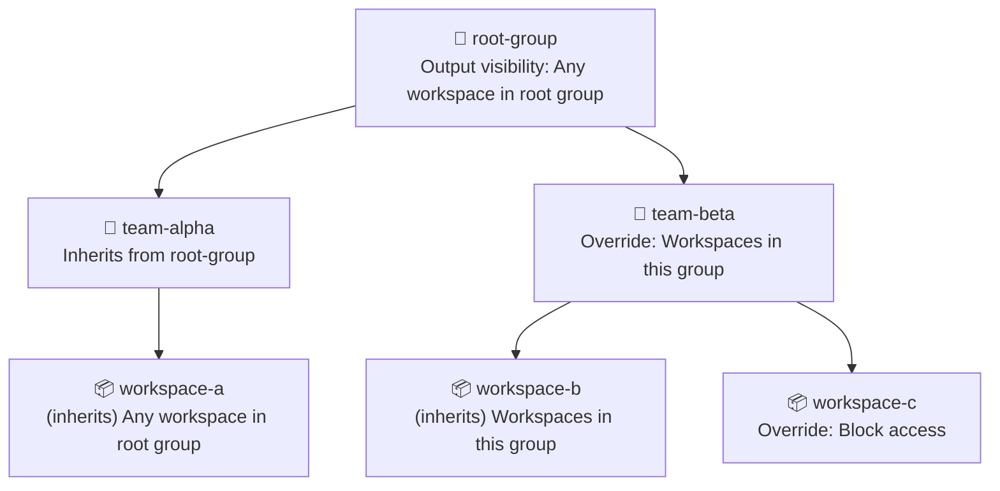

## What are workspaces?

Workspaces contain the actual Terraform deployments and allow the planning, applying, or destroying of infrastructure defined by a Terraform module. In addition, workspaces provide access to a list of runs and their details (logs) among other things like Terraform and environment variables.

Tharsis UI's workspace details page provides access to the deployed resources, input variables, outputs, dependencies, and state file for a given deployment.

> Learn [more](https://www.terraform.io/language/state/workspaces).

:::tip did you know...
Workspaces can share outputs with other workspaces using the [Tharsis Terraform Provider](../provider/intro). Control who can read outputs with [workspace output visibility](#workspace-output-visibility).
:::

### What are workspace labels?

Workspace labels are key-value pairs that you can attach to workspaces to organize, categorize, and manage them more effectively. Labels provide flexible metadata that helps you identify and group workspaces based on your organizational needs.

**Why use workspace labels?**

Labels offer several benefits for workspace management:

- **Environment Organization**: Distinguish between production, staging, and development workspaces
- **Team Ownership**: Identify which team or individual owns or manages a workspace
- **Cost Allocation**: Track and allocate infrastructure costs by project, department, or cost center
- **Compliance Tracking**: Mark workspaces that require specific compliance standards (PCI, HIPAA, etc.)
- **Application Metadata**: Tag workspaces with application names, versions, or components

:::tip
Labels are optional but highly recommended for organizations managing multiple workspaces. They make it easier to understand workspace purpose at a glance and enable better organization as your infrastructure grows.
:::

:::tip Have a question?
Check the [FAQ](#frequently-asked-questions-faq) to see if there's already an answer.
:::

---

## Create a workspace

Workspaces can be created directly via the Tharsis UI or the [Tharsis-CLI](../cli/tharsis/intro.md).

1. From the group details page, click <span style={{ color: '#4db6ac' }}>`NEW WORKSPACE`</span>:
   

2. Provide the workspace name, optionally a short memorable description, and click <span style={{ color: '#4db6ac' }}>`CREATE WORKSPACE`</span>:
   

   :::caution
   Workspace names may only contain **digits**, **lowercase** letters with a **hyphen** or an **underscore** in non-leading or trailing positions.

   A workspace's name **cannot** be changed once created. It will have to be deleted and recreated which is **dangerous**.
   :::

## Update a workspace

1. From the workspace details page, click <span style={{ color: '#4db6ac' }}>`EDIT`</span>:
   

2. Provide a new workspace description (can be empty) and click <span style={{ color: '#4db6ac' }}>`UPDATE WORKSPACE`</span>:
   

---

## Managing Workspace Labels

Workspace labels can be managed through the Tharsis UI or CLI. You can add labels when creating a workspace or manage them on existing workspaces.

### Adding labels during workspace creation

Labels are optional but can be added during workspace creation to help organize and categorize your workspaces from the start.


**To add labels when creating a workspace:**

1. In the create workspace form, locate the **Labels** section below the description field

2. Click the <span style={{ color: '#4db6ac' }}>`MANAGE LABELS`</span> button

3. Enter your label in the label input fields:
   - **Key**: The label identifier (e.g., `environment`, `team`, `cost-center`)
   - **Value**: The label data (e.g., `production`, `platform`, `engineering`)

4. Review your labels in the list below the input field. You can remove any label by clicking the delete icon next to it

5. Click the <span style={{ color: '#4db6ac' }}>`SAVE CHANGES`</span> button to add the label(s) to the workspace

6. Click <span style={{ color: '#4db6ac' }}>`CREATE WORKSPACE`</span> to create the workspace with the specified labels

**Example: Creating a workspace with labels**

When creating a production API workspace, you might add these labels:

- `environment=production`
- `team=platform`
- `app=api-server`
- `cost-center=engineering`

:::tip labels are optional
Labels are completely optional during workspace creation. You can create a workspace without any labels and add them later. However, adding labels during creation helps establish good organizational practices from the start.
:::

### Modifying labels on an existing workspace

To modify labels on a workspace that already exists:

1. From the workspace details page, click <span style={{ color: '#4db6ac' }}>`Settings`</span> to open the workspace settings

2. In the **Labels** section, locate and click the <span style={{ color: '#4db6ac' }}>`MANAGE LABELS`</span> button

3. Enter your new label in the form:
   - **Key**: The label identifier (e.g., `team`, `cost-center`, `version`)
   - **Value**: The label data (e.g., `platform`, `engineering`, `v2-1-0`)

4. Review your labels in the list below the input field. You can remove any label by clicking the delete icon next to it

5. Click the <span style={{ color: '#4db6ac' }}>`SAVE CHANGES`</span> button to modify the label(s) for the workspace


**Example: Adding labels to an existing workspace**

If you have a workspace that was created without labels, you might add:

- `environment=production` to indicate it's a production workspace
- `team=platform` to show ownership
- `cost-center=engineering` for cost tracking

**Example: Updating a label value**

To change an environment label from staging to production:

1. Remove the existing label: `environment=staging`
2. Add the updated label: `environment=production`

:::info updating vs. replacing
When you update a label value through the UI, you're replacing the old value with a new one for the same key. The workspace will only have one value per label key. If you need to track multiple values, consider using different label keys (e.g., `primary-team` and `secondary-team`).
:::

**Example: Removing obsolete labels**

If a workspace is no longer part of a specific project, you might remove:

- `project=customer-migration` (project completed)
- `temporary=true` (no longer temporary)

:::caution removing all labels
You can remove all labels from a workspace if needed. Simply delete each label and update the workspace. The workspace will function normally without any labels, though you may lose organizational benefits that labels provide.
:::

:::tip label management best practices

- **Review labels regularly**: Periodically review workspace labels to ensure they remain accurate and relevant
- **Update labels when roles change**: If workspace ownership or purpose changes, update labels accordingly
- **Remove obsolete labels**: Clean up labels that no longer apply to avoid confusion
- **Use consistent values**: When updating labels across multiple workspaces, use consistent values (e.g., always use `production` instead of mixing `prod`, `production`, and `prd`)
  :::

:::info label format in the UI
The UI will only validate whether any field is empty or if there are duplicate keys. The [label constraints](#workspace-label-constraints) will be validated in the API before allowing you to add them.
:::

:::tip
Remember that you can add up to 10 labels per workspace. See [Workspace Label Constraints](#workspace-label-constraints) for detailed information about label formatting rules and limitations.
:::

### Alternative methods for managing labels

- **CLI**: Use the `tharsis workspace create -label` command to add labels during creation. See [CLI workspace create documentation](../cli/tharsis/commands#workspace-command)
- **CLI**: Use the `tharsis workspace label` command for incremental label updates. See [CLI workspace label documentation](../cli/tharsis/commands#workspace-label-subcommand)

### Viewing existing labels

To view the current labels on a workspace:

1. From the workspace details page, click <span style={{ color: '#4db6ac' }}>`Settings`</span> to open the workspace settings

2. Scroll to the **Labels** section and click <span style={{ color: '#4db6ac' }}>`SHOW`</span> to see all labels currently attached to the workspace

3. Each label is displayed in the format `key:value`

If the workspace has no labels, the labels section will be empty.

### Workspace Label Constraints

When working with workspace labels, you must follow specific formatting rules and limitations to ensure valid label creation. Understanding these constraints will help you avoid validation errors and create labels that work correctly across all Tharsis interfaces.

#### Label Key Requirements

Label keys must adhere to the following rules:

- **Character Set**: Only lowercase letters (a-z), numbers (0-9), hyphens (-), and underscores (\_) are allowed
- **Position Rules**: Keys cannot start or end with a hyphen or underscore
- **Length Limit**: Maximum of 64 characters
- **Empty Keys**: Keys cannot be empty

**Valid label key examples:**

```text
environment
env-type
cost-center
team-name
app123
data-classification
owner
```

**Invalid label key examples:**

```
Environment          ❌ Uppercase letters not allowed
-environment         ❌ Cannot start with hyphen
environment-         ❌ Cannot end with hyphen
_team                ❌ Cannot start with underscore
team_                ❌ Cannot end with underscore
env:type             ❌ Colons not allowed
cost.center          ❌ Periods not allowed
```

#### Label Value Requirements

Label values have more flexible formatting rules:

- **Character Set**: Alphanumeric characters (a-z, A-Z, 0-9), hyphens (-), underscores (\_), and spaces are allowed
- **Length Limit**: Maximum of 255 characters
- **Empty Values**: Values cannot be empty

**Valid label value examples:**

```
production
Production Environment
staging-v2
team_platform
Engineering Dept
v2-1-0
PCI-DSS
```

**Invalid label value examples:**

```
prod@aws             ❌ @ symbol not allowed
env:production       ❌ Colons not allowed
team/platform        ❌ Forward slashes not allowed
cost.center          ❌ Periods not allowed
                     ❌ Empty values not allowed
```

#### Workspace Label Limits

Each workspace has a maximum limit on the number of labels:

- **Maximum Labels**: 10 labels per workspace
- **No Duplicates**: Each label key must be unique within a workspace

:::caution reaching the label limit
If you reach the 10-label limit, consider consolidating labels or using more general categorization. For example, instead of separate labels for `app-name`, `app-version`, and `app-component`, you might use `app=api-server`, `version=v2-1-0`, and `component=backend`.
:::

#### Common Validation Errors

Here are the most common validation errors and how to fix them:

**Invalid label key format:**

This error occurs when a label key doesn't meet the formatting requirements. Common causes include:

- Using uppercase letters in the key
- Including special characters
- Starting or ending with a hyphen or underscore
- Exceeding the 64-character limit

**Fix:** Use only lowercase letters, numbers, hyphens, and underscores. Ensure hyphens and underscores are not at the beginning or end of the key.

**Invalid label value format:**

This error occurs when a label value contains characters outside the allowed set.

**Fix:** Remove special characters like @, :, /, or . from the value. Use only letters, numbers, hyphens, underscores, and spaces.

**Too many labels:**

This error occurs when you attempt to add more than 10 labels to a workspace.

**Fix:** Remove unnecessary labels or consolidate related labels into more general categories to stay within the 10-label limit.

**Empty key or value:**

This error occurs when a label key or value is empty.

**Fix:** Ensure both key and value are provided in the key=value format with non-empty strings for both parts.

**Label key or value too long:**

This error occurs when a label key exceeds 64 characters or a value exceeds 255 characters.

**Fix:** Shorten the key or value to fit within the character limits. Use abbreviations or shorter descriptions where possible.

:::tip best practices

- Use consistent naming conventions across your organization (e.g., always use `environment` instead of mixing `env`, `environment`, and `stage`)
- Keep keys short and descriptive (e.g., `team` instead of `team-name-identifier`)
- Use hyphens for multi-word keys (e.g., `cost-center` instead of `cost_center`) for better readability
- Document your organization's label standards to ensure consistency across teams
  :::

---

## Workspace output visibility

Workspace output visibility controls which workspaces can read another workspace's outputs. It lets you restrict or widen access depending on your organization's needs — from blocking all access to sharing outputs with any workspace in Tharsis.

:::tip Have a question?
Check the [FAQ](#frequently-asked-questions-faq) for common questions about output visibility.
:::

:::info Self-access is always allowed
A workspace can always read its own outputs, regardless of the visibility setting.
:::

### Visibility options

| Option | Who can read outputs |
| ------ | -------------------- |
| Block access | No other workspace can read outputs. |
| Workspaces in this group | Only workspaces in the same immediate parent group. |
| Workspaces in this group or child groups | Workspaces in the same group as this workspace, or in any of that group's subgroups. |
| Any workspace in root group | Any workspace that shares the same top-level (root) group. |
| Any workspace in Tharsis | Any workspace in the entire Tharsis instance. |

:::caution
Workspace outputs can contain sensitive infrastructure values. Reserve **Any workspace in Tharsis** for shared-services workspaces whose outputs are meant to be available instance-wide.
:::

### Inheritance

Output visibility is set at the group level and inherited by all child groups and workspaces in the hierarchy. A child group or workspace can override the inherited value with its own setting.



The response from the API always tells you the current effective value and which group it was inherited from.

### Configuring output visibility on a group

1. Navigate to the group's **Settings** page.
2. Find the **Output Visibility Settings** section (between Provider Mirror and Advanced Settings).
3. If this is not a root group, uncheck **Inherit from parent group** to set a group-specific value.
4. Select a visibility level from the dropdown.
5. Click **Save**.

:::note
Root groups do not show the "Inherit from parent group" checkbox since there is no parent to inherit from.
:::

Child groups and workspaces that inherit from this group reflect the new value on their next read.

### Configuring output visibility on a workspace

1. Navigate to the workspace's **Settings** page.
2. Find the **Output Visibility Settings** section (between Provider Mirror and State Settings).
3. Uncheck **Inherit from parent group** to set a workspace-specific value.
4. Select a visibility level from the dropdown.
5. Click **Save**.

### Viewing the inherited value

When a workspace or child group inherits its visibility setting, a chip displays the current value and which group it comes from. This makes it easy to trace where the setting originates without navigating up the hierarchy.

### Referencing outputs from another workspace

Use the `tharsis_workspace_outputs` or `tharsis_workspace_outputs_json` data source to read outputs from another workspace. See [Retrieving workspace outputs](../provider/intro.md#retrieving-workspace-outputs) for the full syntax and attribute reference.

When access is denied (the visibility setting does not allow the requesting workspace to read outputs), Terraform will return an authorization error during the plan or apply stage.

### Example scenarios

- **Block all access** — Set visibility to "Block access" on a workspace that produces sensitive outputs that should not be consumed by other workspaces.
- **Restrict to same group only** — Set visibility to "Workspaces in this group" on a group that contains sensitive infrastructure workspaces. Only sibling workspaces in the same group can read their outputs.
- **Share across a group and its children** — Set visibility to "Workspaces in this group or child groups" on a parent group. Workspaces in that group and all of its subgroups can share outputs freely.
- **Share within the root group hierarchy** — Set visibility to "Any workspace in root group" on a group that provides shared networking or platform outputs. Any workspace under the same root group can read them, but workspaces in other root groups cannot.
- **Make outputs available to all workspaces** — Set visibility to "Any workspace in Tharsis" on a shared-services group. Any workspace anywhere in Tharsis can read those outputs.

---

## Advanced Settings

### Migrate a workspace

1. From the workspace settings page, click the <span style={{ color: '#ffa726' }}>`MIGRATE WORKSPACE`</span> button:
   

2. Select the new parent group and then click <span style={{ color: '#4db6ac' }}>`MIGRATE`</span>:
   

:::info
To migrate a workspace, the user must have permissions to create workspaces in the new group hierarchy and delete the workspace from the current group. Without these permissions, the migration will fail.
:::

:::danger migration is dangerous
Migrating a workspace will remove <u>**any inherited resource assignments**</u> (e.g., managed identities, service account memberships, VCS provider links) that are not available in the new group hierarchy. This may result in a failed deployment if not reconfigured. However, resources within the workspace, such as variables, outputs, and state files, will remain intact.
:::

### Delete a workspace

1. From the workspace settings page, click the <span style={{ color: 'red' }}>`DELETE WORKSPACE`</span> button:
   

2. Enter the workspace path to confirm deleting and then click <span style={{ color: 'red' }}>`DELETE`</span>:
   

:::danger deletion is dangerous
Deleting a workspace is an <u>**irreversible**</u> operation. All workspace resources such as runs, state files, and outputs will automatically be deleted and <u>**cannot be recovered**</u>.

Proceed with **extreme** caution as force deletion **permanently** removes <u>**ALL**</u> deployment state files and related information from Tharsis. If unsure, **do not** proceed.
:::

## Frequently asked questions (FAQ)

### Who can create / update / delete workspaces?

- A deployer or higher (owner, administrator) can create a workspace.
- Viewer **cannot** modify a workspace.
- System administrator can create / delete **any** workspace.

### Why can't I delete a workspace?

Either you don't have appropriate privileges, or the workspace has resources deployed and Tharsis prevented an accidental deletion.

### I'm confident my Terraform configuration is correct but my runs keep failing. What could be a potential issue?

If your configuration is correct and no other errors are suspected, it could be that you simply forgot to [assign a managed identity](./managed_identities#assign-a-managed-identity) to your workspace. A deployment to AWS or Azure will fail if no IAM role can be assumed.

### How many jobs can simultaneously run on a workspace?

All jobs process in a first in, first out order. A workspace can only have one active job at any given moment.

### Where can I find an overview of my deployed resources, outputs, state file, etc.?

Once a run completes its apply stage, the run populates the workspace details page. The user can view deployed resources, input variables, outputs, dependencies, and of course the state file right from the Tharsis UI.

<details>
<summary>Populated workspace details page</summary>


</details>

### How do I assign a managed identity to a workspace?

See [assign a managed identity](./managed_identities.md#assign-a-managed-identity) for the Tharsis UI.

### How do I read outputs from a workspace in a different root group?

Choose the least permissive approach that meets your need:

- To give access only to specific workspaces, use a [Tharsis managed identity](./managed_identities.md#tharsis-managed-identity) linked to a service account with Viewer access in the target group. This scopes access to that service account. See [Tharsis Managed Identity](./managed_identities.md#tharsis-managed-identity) for the full setup.
- For a workspace whose outputs are intentionally shared instance-wide, set the output visibility on the target workspace (or its parent group) to **Any workspace in Tharsis**. See [workspace output visibility](#workspace-output-visibility) for details.

:::caution
**Any workspace in Tharsis** is the broadest option. Use it only when the outputs are meant to be read across the whole instance.
:::

### Can a workspace always read its own outputs?

Yes. Self-access is always allowed regardless of the visibility setting. A workspace's own runs can always read its outputs.

### What happens if I change the visibility setting on a group?

The new setting applies to all child groups and workspaces that inherit from it, taking effect on their next read. A more restrictive setting removes access for workspaces that no longer meet it. A more permissive setting grants access to the wider audience, including the outputs of every child group and workspace that inherits the setting.

### What error do I see when output access is denied?

Terraform will return an authorization error during the plan or apply stage. The error indicates that the requesting workspace does not have permission to read the target workspace's outputs.

### What are workspace labels and how do I use them?

Workspace labels are key-value pairs that help you organize, categorize, and manage workspaces. They're useful for identifying environments (production, staging), tracking ownership (team, owner), allocating costs (cost-center, project), and marking compliance requirements.

**Quick example:**

```
environment=production
team=platform
cost-center=engineering
```

You can add labels when creating a workspace or manage them later through the workspace edit interface. Labels are completely optional but recommended for organizations managing multiple workspaces.

**Learn more:**

- [What are workspace labels?](#what-are-workspace-labels) - Overview and use cases
- [Managing workspace labels](#managing-workspace-labels) - UI-based label management
- [Workspace Label Constraints](#workspace-label-constraints) - Formatting rules and limits
- [CLI Label Management](../cli/tharsis/commands#workspace-label-subcommand) - Command-line label operations

### Why am I getting a label validation error?

Label validation errors occur when label keys or values don't meet the required formatting rules. Common issues include:

- **Uppercase letters in keys**: Label keys must be lowercase only (use `environment` not `Environment`)
- **Invalid characters**: Keys can only contain lowercase letters, numbers, hyphens, and underscores. Values can also include uppercase letters and spaces
- **Leading/trailing hyphens or underscores**: Keys cannot start or end with `-` or `_` (use `env-type` not `-env-type` or `env-type-`)
- **Special characters**: Characters like `@`, `:`, `/`, or `.` are not allowed in keys or values
- **Empty keys or values**: Both key and value must have content
- **Length limits**: Keys are limited to 64 characters, values to 255 characters

**Examples of fixing common errors:**

```
❌ Environment=prod     → ✅ environment=prod
❌ -environment         → ✅ environment
❌ env:prod             → ✅ env-prod
❌ team@platform        → ✅ team-platform
```

**Learn more:**

- [Workspace Label Constraints](#workspace-label-constraints) - Complete formatting rules and common validation errors
- [CLI workspace label command](../cli/tharsis/commands#workspace-label-subcommand) - CLI label management

### How many labels can I add to a workspace?

Each workspace can have a maximum of **10 labels**. Each label key must be unique within the workspace.

If you reach the 10-label limit, consider consolidating labels or using more general categorization. For example:

- Instead of: `app-name=api`, `app-version=v2`, `app-component=backend` (3 labels)
- Use: `app=api-server`, `version=v2`, `component=backend` (3 labels with more concise keys)

You can also evaluate which labels are most important for your organizational needs and remove less critical ones.

**Learn more:**

- [Workspace Label Constraints](#workspace-label-constraints) - Label limits and rules

### What happens to labels when I delete a workspace?

When you delete a workspace, all labels attached to that workspace are permanently deleted along with the workspace itself. Labels cannot be recovered after workspace deletion.

If you need to preserve label information before deleting a workspace:

1. Document the labels manually or export them through the CLI or API
2. Consider if you need to recreate similar labels on a replacement workspace
3. Review any automation or scripts that depend on those labels

Remember that workspace deletion is irreversible and removes all workspace resources including labels, runs, state files, and outputs.

**Related documentation:**

- [Delete a workspace](#delete-a-workspace) - Workspace deletion process
- [CLI workspace commands](../cli/tharsis/commands#workspace-command) - Viewing and managing workspaces via CLI
